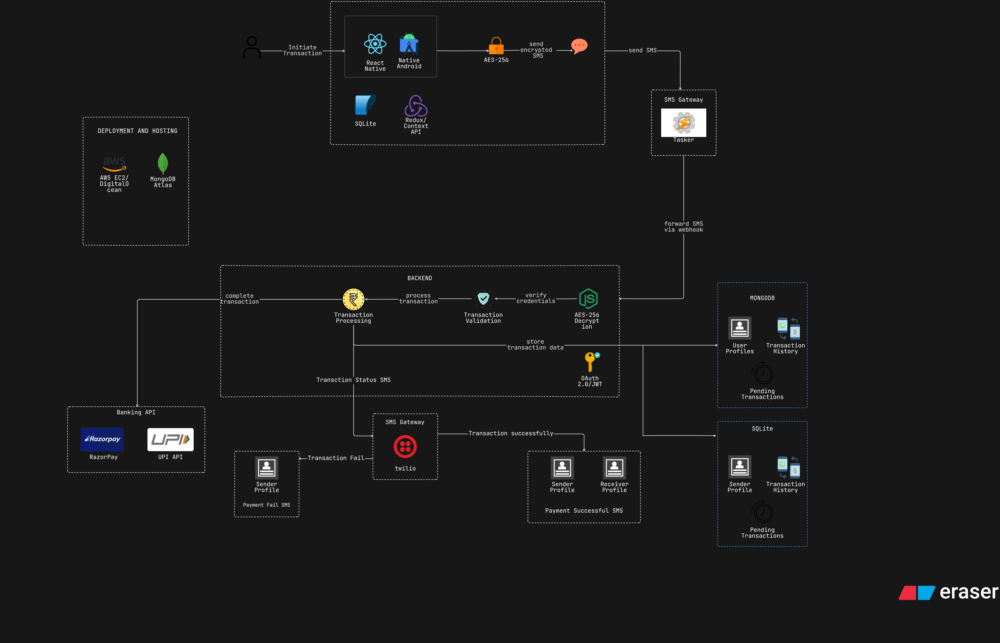

# 💸 Offline Payment System  

This project demonstrates an **Offline Payment System** that enables secure financial transactions even without internet connectivity.  
It uses mobile applications, SMS gateways, and backend validation through third-party APIs such as **Razorpay** and **UPI**, ensuring encrypted transaction processing, secure storage, and SMS-based status notifications.

---

## 🎥 Demo Video

---

## 📌 Features
- **React Native Mobile App** for initiating offline transactions (Android support).
- **AES-256 Encryption** for securing SMS-based transaction data.
- **SMS Gateway Integration** using **Tasker** and **Twilio**.
- **Node.js Backend** responsible for:
  - Transaction validation  
  - Transaction processing  
  - Authentication using **OAuth 2.0 / JWT**
- **Database Support:**
  - **MongoDB Atlas** for cloud-based transaction records  
  - **SQLite** for local storage on the device
- **Third-party API Integrations** with **Razorpay** and **UPI** for payment processing.
- **Real-time Notifications:**
  - SMS updates for **Payment Success** and **Payment Failure**

---

## 🛠️ Tech Stack
- **Frontend:** React Native, Redux Context API, SQLite  
- **Backend:** Node.js, Express.js, AES-256 Encryption, OAuth 2.0 / JWT  
- **Database:** MongoDB Atlas, SQLite  
- **APIs:** Razorpay, UPI  
- **SMS Gateways:** Tasker, Twilio  
- **Hosting & Deployment:** AWS EC2, DigitalOcean  

---

## 📂 System Architecture

---

## 🚀 Transaction Flow
1. **User initiates a transaction** via the React Native mobile app.  
2. Transaction data is **encrypted using AES-256** and sent via SMS.  
3. **Tasker** automatically forwards the SMS to the backend using **webhooks**.  
4. **Backend validates & processes** the transaction:  
   - Verifies user credentials  
   - Connects with **Banking APIs (Razorpay / UPI)**  
5. **Transaction status** is updated in both **MongoDB** (cloud) and **SQLite** (local).  
6. **Twilio** sends confirmation SMS notifications to sender and receiver.  

---

## 📬 Notifications
- **✅ Payment Successful:** Both sender and receiver receive confirmation SMS.  
- **❌ Payment Failure:** Sender receives failure notification SMS.  

---

## ⚡ Deployment
- Backend hosted on **AWS EC2** or **DigitalOcean**.  
- **MongoDB Atlas** handles cloud data, while **SQLite** supports offline persistence.  

---

## 🔮 Future Enhancements
- Multi-currency transaction support  
- Integration with additional banking APIs  
- Analytics dashboard for administrators  
- iOS app version support  

---

## 👨‍💻 Author
Developed by **Ganesh Tambekar** as part of an **Offline Digital Payment Solution** initiative.
